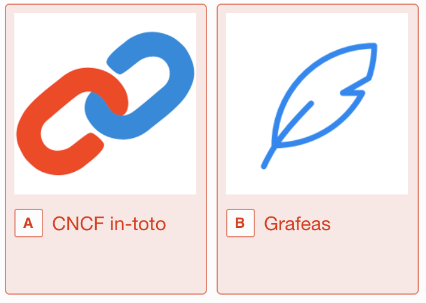
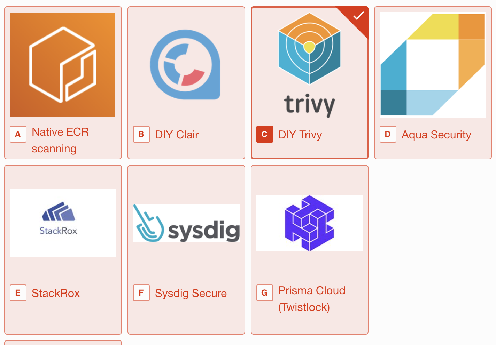
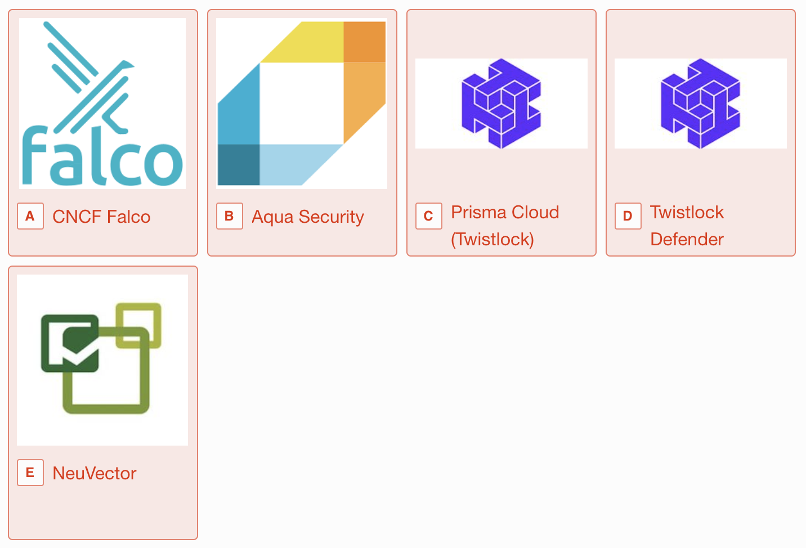

[](http://makeapullrequest.com)

# Cluster Setup – 10%

## Use Network security policies to restrict cluster level access
- https://kubernetes.io/docs/concepts/services-networking/network-policies/
- 🔬 https://github.com/ahmetb/kubernetes-network-policy-recipes 
- https://medium.com/@reuvenharrison/an-introduction-to-kubernetes-network-policies-for-security-people-ba92dd4c809d
- https://github.com/Tufin/test-network-policies

## Use CIS benchmark to review the security configuration of  Kubernetes components (etcd, kubelet, kubedns, kubeapi)

```sh
# install kube-bench in the current host dir
docker run --rm -it -v `pwd`:/host aquasec/kube-bench:latest install

# benchmarking your cluster ( verify the curren kubeconfig before)
./kube-bench <name-of-node>
```

- https://www.cisecurity.org/benchmark/kubernetes/
- https://github.com/dev-sec/cis-kubernetes-benchmark
- https://github.com/aquasecurity/kube-bench
- https://cloud.google.com/kubernetes-engine/docs/concepts/cis-benchmarks

## Properly set up Ingress objects with security control

- [secure an Ingress by specifying a Secret that contains a TLS private key and certificate](https://kubernetes.io/docs/concepts/services-networking/ingress/#tls)

## Protect node metadata and endpoints

- [Retrieve Node Metadata .e.g: AWS](https://docs.aws.amazon.com/AWSEC2/latest/UserGuide/instancedata-data-retrieval.html) : https://docs.aws.amazon.com/AWSEC2/latest/UserGuide/instancedata-data-retrieval.html

- e.g: [Restricting access to Amazon EC2 instance profile credentials](https://docs.aws.amazon.com/eks/latest/userguide/restrict-ec2-credential-access.html) or its [UserData](https://docs.aws.amazon.com/AWSEC2/latest/UserGuide/ec2-instance-metadata.html) could be part of the exam.


## Minimize use of, and access to, GUI elements

- https://blog.heptio.com/on-securing-the-kubernetes-dashboard-16b09b1b7aca

## Verify platform binaries before deploying

- https://github.com/kubernetes/kubernetes/releases


# Cluster Hardening – 15%

## Restrict access to Kubernetes API
- [Controlling Access to the Kubernetes API](https://kubernetes.io/docs/reference/access-authn-authz/controlling-access/) : https://kubernetes.io/docs/reference/access-authn-authz/controlling-access/ 

## Use Role Based Access Controls to minimize exposure

- https://kubernetes.io/docs/reference/access-authn-authz/rbac/
- https://github.com/David-VTUK/CKA-StudyGuide/blob/master/RevisionTopics/Part-5-Security.md

##  Exercise caution in using service accounts e.g. disable defaults, minimize permissions on newly created ones

- https://kubernetes.io/docs/reference/access-authn-authz/service-accounts-admin/
- https://kubernetes.io/docs/tasks/configure-pod-container/configure-service-account/

## Update Kubernetes frequently

- https://kubernetes.io/docs/tasks/administer-cluster/kubeadm/kubeadm-upgrade/


# System Hardening – 15%

## Minimize host OS footprint (reduce attack surface)

- [CIS benchmark Overview/General](https://www.cisecurity.org/benchmark/distribution_independent_linux/)

- CIS benchmark dedicated for each distribution
* https://www.cisecurity.org/benchmark/red_hat_linux/
* https://www.cisecurity.org/benchmark/ubuntu_linux/
* https://www.cisecurity.org/benchmark/centos_linux/
* https://www.cisecurity.org/benchmark/debian_linux/
* https://www.cisecurity.org/benchmark/suse_linux/
* https://www.cisecurity.org/benchmark/oracle_linux/

## Minimize IAM roles

- [Least privilege pincipal](https://docs.aws.amazon.com/IAM/latest/UserGuide/best-practices.html#grant-least-privilege) is generally the way to go!

## Minimize external access to the network

- ACL at the level of subnet : https://docs.aws.amazon.com/vpc/latest/userguide/vpc-network-acls.html
- Security Group at the level of machine : https://docs.aws.amazon.com/AWSEC2/latest/UserGuide/ec2-security-groups.html
- Firewall at the level of OS ( ufw, firewall-cmd ) : https://www.linode.com/docs/security/firewalls/configure-firewall-with-ufw/

## Appropriately use kernel hardening tools such as AppArmor, seccomp

- https://kubernetes.io/docs/tutorials/clusters/apparmor/

- https://kubernetes.io/docs/tutorials/clusters/seccomp/

- 📚 ["Container Security"](https://cdn2.hubspot.net/hubfs/1665891/Assets/Container%20Security%20by%20Liz%20Rice%20-%20OReilly%20Apr%202020.pdf?utm_medium=email&_hsmi=85733108&_hsenc=p2ANqtz--tQO3LhW0VqGNthE1dZqnfki1pYhEq-I_LU87M03pmQlvhXhA1lO4jO3vLjN4NtcbEiFyIL2lEBlzzMHe96VPXERZryw&utm_content=85733108&utm_source=hs_automation) by Liz Rice which covers AppArmor, Seccomp, SELinux and the whole gang.


#  Minimize Microservice Vulnerabilities – 20%

## Setup appropriate OS level security domains e.g. using PSP, OPA, security contexts

- > PSP : https://kubernetes.io/docs/concepts/policy/pod-security-policy/
- > OPA : https://www.openpolicyagent.org/docs/latest/kubernetes-primer/
- > Security Context : https://kubernetes.io/docs/tasks/configure-pod-container/security-context/

## Manage Kubernetes secrets

- https://kubernetes.io/docs/concepts/configuration/secret/

- 📹 TGIK - Advanced k8s secret management : https://www.youtube.com/watch?v=IznsHhKL428&ab_channel=VMwareCloudNativeApps

- 🔬 Sealed Secrets : https://github.com/bitnami-labs/sealed-secrets

- secrets-store-csi-driver : https://github.com/kubernetes-sigs/secrets-store-csi-driver

## Use container runtime sandboxes in multi-tenant environments (e.g. gvisor, kata containers)

- gVisor : https://gvisor.dev/docs/user_guide/install/

- kata : https://github.com/kata-containers/kata-containers

- 🔬 Hands-on Kata : https://github.com/abdennour/abdennour.github.io/blob/master/_posts/2018-06-09-successfully-running-kata-containers-in-the-cloud.markdown

## Implement pod to pod encryption by use of mTLS

- https://kubernetes.io/docs/tasks/tls/managing-tls-in-a-cluster/

- Using **istio** , https://developer.ibm.com/technologies/containers/tutorials/istio-security-mtls/

- Using **linkerd**, https://linkerd.io/2/features/automatic-mtls/

- 🔬 https://www.istioworkshop.io/11-security/01-mtls/


# Supply Chain Security – 20%

## Minimize base image footprint

- [7 best practices](https://cloud.google.com/blog/products/gcp/7-best-practices-for-building-containers) for build containers.

- https://github.com/GoogleContainerTools/distroless


## Secure your supply chain: whitelist allowed registries, sign and validate images

- Docker Way : https://docs.docker.com/engine/security/trust/content_trust/

- Tools for manage supply chain and artifacts:


- tools for siging container image Cryptographically:


- example - [restrict pulling images from registries](https://www.openpolicyagent.org/docs/latest/kubernetes-primer/)

- Related also with https://kubernetes.io/blog/2019/03/21/a-guide-to-kubernetes-admission-controllers/

## Use static analysis of user workloads (e.g.Kubernetes resources, Docker files)

- kubehunter: https://github.com/aquasecurity/kube-hunter
- Tools around static container image scan:


## Scan images for known vulnerabilities

- Clair: https://github.com/quay/clair

- Tools around dynamic container image scan : 



# Monitoring, Logging and Runtime Security – 20%

## Perform behavioral analytics of syscall process and file activities at the host and container level to detect malicious activities

- https://kubernetes.io/docs/tutorials/clusters/seccomp/

## Detect threats within physical infrastructure, apps, networks, data, users and workloads

## Detect all phases of attack regardless where it occurs and how it spreads

- Get the General Concept : https://www.dnvgl.com/article/the-seven-phases-of-a-cyber-attack-118270

## Perform deep analytical investigation and identification of bad actors within environment

## Ensure immutability of containers at runtime

- [Falco](https://falco.org/docs/) might help ?

## Use Audit Logs to monitor access

- https://kubernetes.io/docs/tasks/debug-application-cluster/audit/

-------

# Other links :

- [SIG security - MoM](https://docs.google.com/document/d/170y5biX9k95hYRwprITprG6Mc9xD5glVn-4mB2Jmi2g/edit#heading=h.7hyo00ewips2)

- [Firecracker](https://firecracker-microvm.github.io/) for multi-tenancy, [Bottlerocket](https://aws.amazon.com/bottlerocket/) to reduce the attack surface, [audit2rbac](https://github.com/liggitt/audit2rbac) for generating RBAC roles

-------

# Disclaimer

> The given links are our assumptions and ideas - we neither have insights into the exam requirements, nor do we know how exactly it will look like. We are guessing about possibilities and try to collect resources.


# License

[](https://creativecommons.org/licenses/by-sa/4.0/)


# Stargazers over time

[](https://starchart.cc/abdennour/certified-kubernetes-security-specialist)
